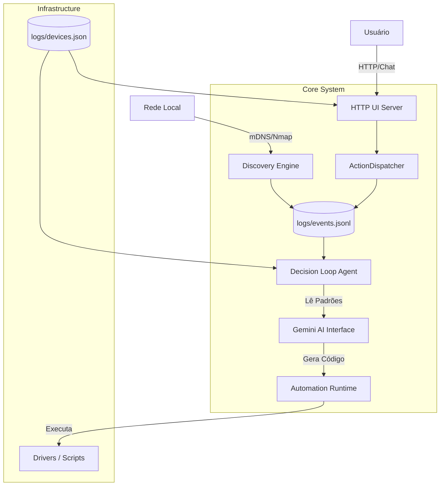

# Arquitetura do Sistema

O ELO é construído sobre uma arquitetura modular em Node.js, orquestrada via Docker. O sistema é desenhado para ser **Event-Driven**, onde a "fonte da verdade" são arquivos de log append-only (JSONL).

## 🏗️ Diagrama de Componentes

## 🧩 Componentes Principais

### 1. HTTP UI & API (`src/server/http-ui.ts`)
- **Porta:** 3000
- **Função:** Interface primária de interação.
- **Responsabilidades:**
  - Servir o frontend estático.
  - Receber mensagens de chat (`POST /api/chat`).
  - Injetar contexto de dispositivos e logs no prompt da IA.
  - Filtrar respostas inválidas ou recusas da IA ("As an AI language model...").

### 2. Action Dispatcher (`src/server/action-dispatcher.ts`)
- **Função:** Ponte entre a intenção da IA e a execução real.
- **Fluxo:**
  1. Recebe uma string de ação da IA (ex: `ar_sala=on`).
  2. Valida o formato.
  3. (Futuro) Invoca o driver específico em `src/drivers/`.
  4. **Crítico:** Registra o evento `action_dispatched` no `events.jsonl`. Isso garante que o sistema "saiba" que tentou agir.

### 3. Discovery Engine (`src/server/discovery.ts`)
- **Ferramentas:** `node-nmap`, `bonjour-service`.
- **Operação:**
  - **Passiva:** Escuta broadcasts mDNS/Bounjour.
  - **Ativa:** Varre a rede periodicamente buscando portas abertas (HTTP, MQTT, RTSP).
  - Tenta identificar ("Fingerprint") o dispositivo usando a IA (`prompts.fingerprintDevice`).

### 4. Storage Layer (`src/cli/utils/storage-files.ts`)
O sistema não usa banco de dados SQL. A persistência é baseada em arquivos JSON/JSONL para facilitar portabilidade e leitura humana.
- `logs/events.jsonl`: Histórico imutável de tudo que aconteceu (sensor readings, ações, erros).
- `logs/requests.jsonl`: Histórico de interações do usuário (chat).
- `logs/devices.json`: Catálogo atualizado de dispositivos reconhecidos.

### 5. Automation Engine (`src/server/automation_engine.ts`)
- **Função:** Runtime de automações.
- **Mecanismo:**
  - Monitora a pasta `automations/`.
  - Carrega dinamicamente arquivos `.ts` e `.js`.
  - Executa a função `default export` de cada automação sempre que um novo evento chega no sistema.
